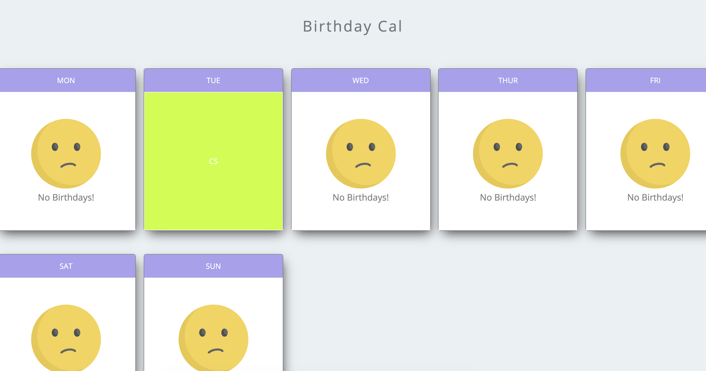

# Birthday Cal


Birthday Cal is a week long Calendar. It's a fun way to demonstrate Vanilla JS skills.

## Deployment

[](https://app.netlify.com/sites/birthday-cal/deploys)

[Deployed Site](https://birthday-cal.netlify.app)

## How does it work

Just drop a json data in the text area in the below given format and hit the update button to see the magic!

```js
[
  {
    name: "Tyrion Lannister",
    birthday: "12/02/1978",
  },
  {
    name: "Cersei Lannister",
    birthday: "11/30/1975",
  },
  {
    name: "Daenerys Targaryen",
    birthday: "11/24/1991",
  },
  {
    name: "Arya Stark",
    birthday: "11/25/1996",
  },
];
```

### sample data file

[data.json](./data.json)

### Input


### Output




## Usage

1.  Clone the repository

        git clone URL

2.  `cd` into the repository folder

3.  Open the index.html file using modern web browser or launch using live server in VSCode.
